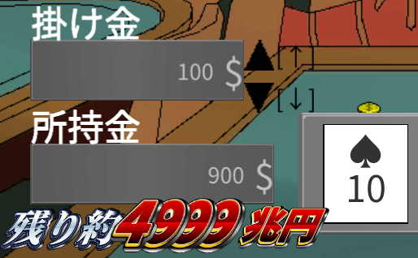

# SourceCode
**制作したゲームのソースコードです。フォルダの番号が若いほど昔の作品になります。**

ゲームは↓から遊べます。

https://unityroom.com/users/jkw6o3n1dzx7vb9umt0s

**【作品概要】**

**１．タワーディフェンス**

初制作の作品です。制作期間１週間。画面の右側から攻めてくる敵を防衛するゲーム。

　

**２．カジノのポーカーで5000兆円集めればゲームクリア**

制作期間3週間。ポーカーをするゲーム。経験値を使って役を揃いやすくしたり、ベット上限を上げたりできる。

　
**３．猫と幼女のアクションRPG**

制作期間2週間。2Dアクションゲーム。全４ステージで２種類のエンディングがあります。

　
**４．犬QWOP**

制作期間１日。犬をゴールまで動かすイライラ系ゲーム。ゲームパッドでも操作できる。
　

**５．およげ大トロくん**

制作期間１日。マグロを操作するランゲーム。
　

**６．100日後に死ぬ犬**

制作期間１週間。100日後に死ぬ運命にある犬を育成するRPG。

　
**７．スーパー３Dアクションゲーム**

制作期間２日。マリオを操作して８枚のコインを集める３Dアクションゲーム。

　
**８．ずんだもんぬりえ**

制作期間１日。塗り絵のゲーム。完成した絵はTwitterに投稿できる。

　
**９．DragonHunt：Re**

制作期間２カ月。FF13を意識したリアルタイムRPG。サウンドと背景イラスト以外全て自作。セーブ機能があります。

　
**１０．おしえてAIチャット**

制作期間１週間。チャットAIを育てるゲーム。ゲーム制作イベント「unity1week」総合30位。

　
**１１．都立大学からの脱出**

制作期間２週間。単位を集めて大学から卒業（脱出）するゲーム。
